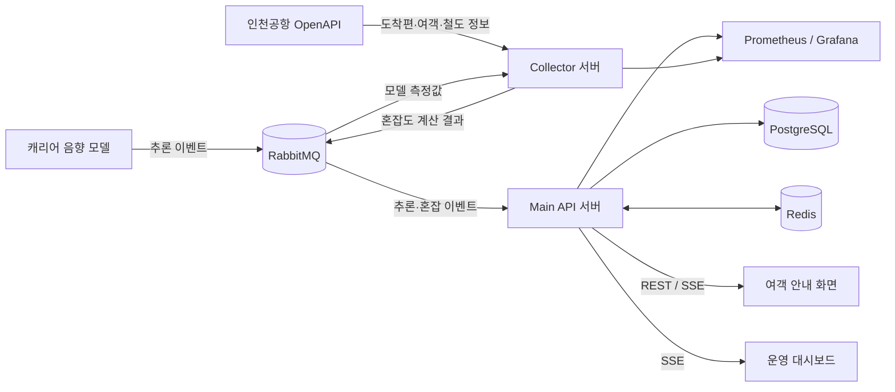

# DRRK (드르륵)

> **캐리어 소리와 공항 운항 데이터를 결합한 공항철도 혼잡 예측·안내 서비스**

DRRK는 인천공항 입국장에서 감지한 캐리어 통과량을 항공편 도착 현황, 여객 예고, 공항철도 운행 정보와 결합해 공항철도 승강장의 혼잡도를 계산합니다. 여객에게는 덜 붐비는 이동 경로와 탑승 위치를 안내하고, 운영자에게는 실시간 캐리어 흐름과 종합 혼잡도를 대시보드로 제공합니다.

---

## 1. 핵심 기능

| 구분 | 제공 기능 |
|---|---|
| **실시간 감지** | 외부 음향 모델이 산출한 공간별 캐리어 통과량을 RabbitMQ로 수신 |
| **공항 데이터 수집** | 인천공항 도착편, 여객 예고, 공항철도 운행 정보를 주기적으로 수집 |
| **혼잡도 계산** | 모델 측정값과 공항·철도 데이터를 결합해 승강장 구간별 혼잡도와 추천 경로 산출 |
| **여객 안내** | 공항 지도 위 혼잡 단계, 다음 열차, 추천 이동 경로를 제공 |
| **운영 대시보드** | 캐리어 감지량과 종합 혼잡도를 SSE 기반 실시간 차트로 시각화 |
| **회원 인증** | 이메일 인증, 회원가입·로그인, JWT Access/Refresh Token 회전 지원 |
| **운영 안정성** | DLQ, Redis 최신 상태 공유, Prometheus/Grafana 관측, main 서버 Blue/Green 배포 지원 |

> 백엔드는 모델이 생성한 구조화 이벤트만 처리하며 원본 음성 파일이나 대화 내용을 저장하지 않습니다.

---

## 2. 시스템 흐름



1. 외부 음향 모델이 공간별 캐리어 통과 이벤트를 RabbitMQ에 발행합니다.
2. `app-collector`가 모델 측정값과 인천공항 OpenAPI 데이터를 모아 혼잡도를 계산합니다.
3. 계산 결과를 다시 RabbitMQ에 발행하면 `app-main`이 소비해 최신 상태를 Redis에 저장합니다.
4. `app-main`은 REST API와 SSE로 여객 화면 및 운영 대시보드에 최신 정보를 전달합니다.
5. 비정상 메시지는 DLQ로 격리하고, 애플리케이션 지표는 Prometheus와 Grafana에서 확인합니다.

---

## 3. 저장소 구조

```text
Tomorrow_Hackathon/
├─ drrk_BE/                    # Spring Boot 백엔드 멀티모듈
│  ├─ common/                  # 공용 도메인·오류 모델·메시지 계약
│  ├─ app-main/                # REST API, 인증, SSE, 메시지 소비
│  └─ app-collector/           # 외부 API 수집, 혼잡도 계산, 메시지 발행
├─ drrk_FE/vite-project/       # 여객용 React 웹 화면
├─ drrk_dashboard/             # 운영자용 React 대시보드
├─ deploy/
│  ├─ main/                    # main EC2·Nginx·Blue/Green 배포 구성
│  ├─ collector/               # collector EC2·RabbitMQ 배포 구성
│  └─ ops/                     # 운영 진단·데모 데이터 주입 스크립트
├─ monitoring/                 # Prometheus 수집 설정
├─ docker-compose.yml          # 로컬 통합 개발 환경
└─ .github/workflows/          # CI와 AWS 배포 자동화
```

---

## 4. 백엔드 멀티모듈

백엔드는 역할이 다른 두 실행 서버의 자원을 격리하면서 공용 계약을 재사용하기 위해 Gradle 멀티모듈로 구성했습니다.

```text
app-main ─────┐
              ├──▶ common
app-collector ┘
```

| Gradle 경로 | 모듈 | 역할 |
|---|---|---|
| `:common` | `drrk_BE/common` | 사용자 도메인, 공용 오류 응답, 혼잡도 RabbitMQ 메시지 계약 |
| `:main` | `drrk_BE/app-main` | 인증·보안, PostgreSQL/Redis, 혼잡도·추론 메시지 소비, REST API와 SSE |
| `:collector` | `drrk_BE/app-collector` | 인천공항 OpenAPI 수집, 모델 이벤트 소비, 혼잡도 계산 및 발행 |

- `app-main`과 `app-collector`는 서로 직접 의존하지 않습니다.
- 두 실행 모듈이 함께 사용하는 코드만 `common`에 둡니다.
- `common`은 실행 모듈의 코드나 설정에 의존하지 않습니다.
- 각 실행 모듈의 `bootJar`에는 `common`이 함께 패키징되므로 별도 서버로 배포하지 않습니다.

---

## 5. 로컬 실행

### 요구사항

- Docker Engine 및 Docker Compose
- JDK 21 — 백엔드를 직접 실행하거나 테스트할 때 필요
- Node.js 20 이상 — 프론트엔드와 대시보드를 실행할 때 필요

### 5.1 백엔드와 인프라

루트 Docker Compose는 PostgreSQL, RabbitMQ, Redis, 두 백엔드 서버, Prometheus, Grafana를 한 번에 실행합니다.

```bash
cp .env.example .env

# .env의 비밀번호, JWT, SMTP, 인천공항 OpenAPI 값을 로컬 환경에 맞게 수정
docker compose up -d --build
```

기본 접속 주소는 다음과 같습니다.

| 서비스 | 주소 |
|---|---|
| Main API | `http://localhost:8080` |
| Collector health | `http://localhost:8081/healthz` |
| RabbitMQ Management | `http://localhost:15672` |
| Prometheus | `http://localhost:9090` |
| Grafana | `http://localhost:3000` |

```bash
# 상태 확인
docker compose ps
curl http://localhost:8080/healthz
curl http://localhost:8081/healthz

# 종료
docker compose down
```

데이터 볼륨까지 제거하려면 영향을 확인한 뒤 `docker compose down -v`를 사용하세요.

### 5.2 여객 안내 화면

```bash
cd drrk_FE/vite-project
cp .env.example .env
npm ci
npm run dev
```

기본 주소는 `http://localhost:5173`이며, `.env`의 `VITE_API_BASE_URL`은 로컬 Main API인 `http://localhost:8080`을 가리킵니다.

### 5.3 운영 대시보드

여객 화면과 동시에 실행할 때는 다른 포트를 지정합니다.

```bash
cd drrk_dashboard
npm ci
VITE_API_BASE_URL=http://localhost:8080 npm run dev -- --port 5174
```

---

## 6. 빌드 및 테스트

### 백엔드

```bash
cd drrk_BE

# 전체 모듈 테스트
./gradlew :common:test :main:test :collector:test --no-daemon

# 실행 모듈별 개발 서버
./gradlew :main:bootRun
./gradlew :collector:bootRun

# 배포용 실행 JAR 생성
./gradlew :main:bootJar :collector:bootJar
```

### 여객 안내 화면

```bash
cd drrk_FE/vite-project
npm test
npm run lint
npm run build
```

### 운영 대시보드

```bash
cd drrk_dashboard
npm test
npm run lint
npm run build
```

---

## 7. 주요 API

| Method | Path | 설명 |
|---|---|---|
| `GET` | `/healthz` | Main 서버와 의존 인프라 상태 확인 |
| `GET` | `/api/v1/auth/csrf` | CSRF 토큰 발급 |
| `POST` | `/api/v1/auth/email-verifications` | 이메일 인증번호 발송 |
| `POST` | `/api/v1/auth/email-verifications/confirm` | 이메일 인증번호 확인 |
| `POST` | `/api/v1/auth/signup` | 로컬 회원가입 |
| `POST` | `/api/v1/auth/login` | 로그인 및 인증 쿠키 발급 |
| `POST` | `/api/v1/auth/refresh` | Refresh Token 회전 |
| `POST` | `/api/v1/auth/logout` | 로그아웃 및 세션 폐기 |
| `GET` | `/api/v1/users/me` | 현재 사용자 조회 |
| `GET` | `/api/v1/platform/congestion` | 최신 승강장 혼잡도 조회 |
| `GET` | `/api/v1/routes/recommendation` | 혼잡도를 반영한 추천 경로 조회 |
| `GET` | `/api/v1/airport-railroad/arrivals` | 다음 공항철도 도착 정보 조회 |
| `GET` | `/api/v1/inference/carriers/stream` | 캐리어 감지량·혼잡도 SSE 구독 |

Collector 서버는 외부에 비즈니스 API를 노출하지 않고 수집·계산 파이프라인과 `/healthz`만 담당합니다.

---

## 8. 기술 스택

| 영역 | 기술 |
|---|---|
| Frontend | React 19, TypeScript 6, Vite 8, Vitest |
| Backend | Java 21, Spring Boot 4.0, Gradle 9.5 |
| Data | PostgreSQL 16, Redis 7 |
| Messaging | RabbitMQ 3, Dead Letter Queue |
| Observability | Spring Boot Actuator, Micrometer, Prometheus 3, Grafana 12 |
| Infrastructure | Docker, Docker Compose, Nginx, AWS EC2/RDS/SSM, GitHub Actions |

---

## 9. 배포 구조

운영 환경은 Main과 Collector 워크로드를 서로 다른 EC2에 배치합니다.

| 대상 | 구성 | 배포 방식 |
|---|---|---|
| **Main EC2** | Nginx, `app-main` Blue/Green 슬롯, Redis | 신규 슬롯 헬스체크 → Nginx 전환 → SSE drain → 이전 슬롯 graceful stop |
| **Collector EC2** | `app-collector`, RabbitMQ | 이미지 교체 후 헬스체크, 실패 시 이전 이미지로 롤백 |
| **Database** | PostgreSQL | AWS RDS를 Main 서버에서 사용 |

GitHub Actions의 `Backend Deploy` 워크플로를 수동 실행하면 선택한 이미지를 Docker Hub에 발행한 뒤 AWS SSM으로 배포합니다. 운영 환경 변수와 인증 정보는 저장소에 커밋하지 않고 GitHub Environment 및 EC2의 `/opt/drrk/env/*.env`에서 관리합니다.

---

## 10. 코드 배치 원칙

| 만들려는 코드 | 위치 |
|---|---|
| 두 백엔드가 공유하는 도메인·DTO·메시지 계약·공용 오류 | `drrk_BE/common` |
| REST API, 인증, SSE, DB·Redis 연동 | `drrk_BE/app-main` |
| 외부 데이터 수집, 혼잡도 계산, 메시지 발행 | `drrk_BE/app-collector` |
| 여객용 화면과 상호작용 | `drrk_FE/vite-project` |
| 운영자용 시각화와 모니터링 UI | `drrk_dashboard` |

기능 브랜치는 `develop`에서 시작하고, 변경한 모듈의 타깃 테스트를 먼저 실행한 뒤 영향 범위에 맞춰 전체 검증을 수행합니다.
